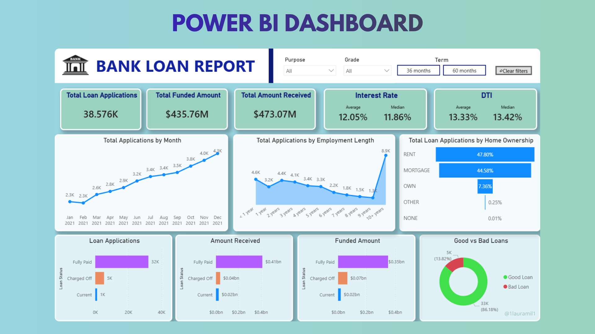
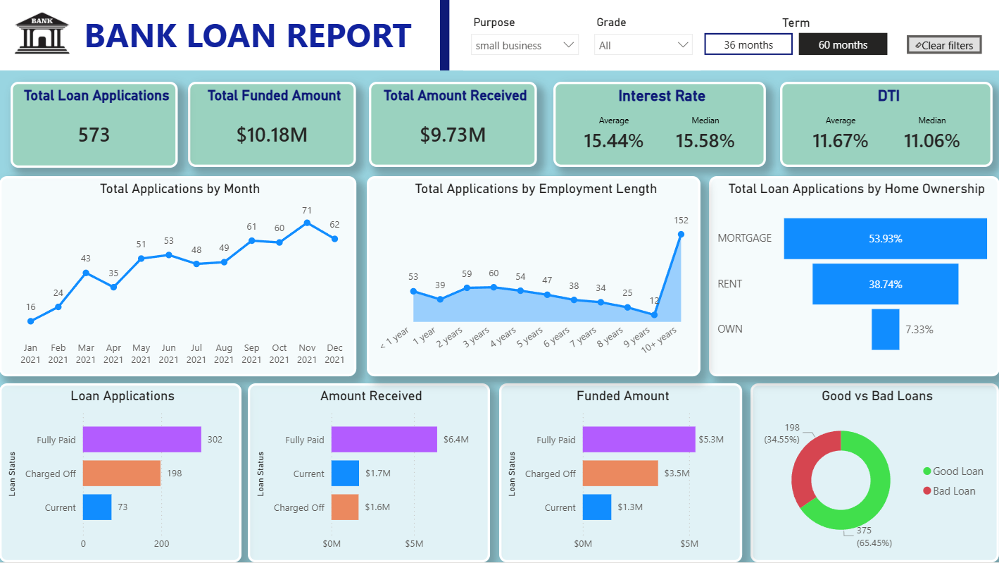

# Bank Loan Analysis Dashboard

## 📊 Project Overview
This Power BI dashboard provides a comprehensive analysis of bank loan data to monitor lending activities, assess portfolio health, and evaluate risk. It was designed to help financial managers make data-driven decisions regarding loan approvals and collection strategies.

## Dashboard Preview

## Using filters

